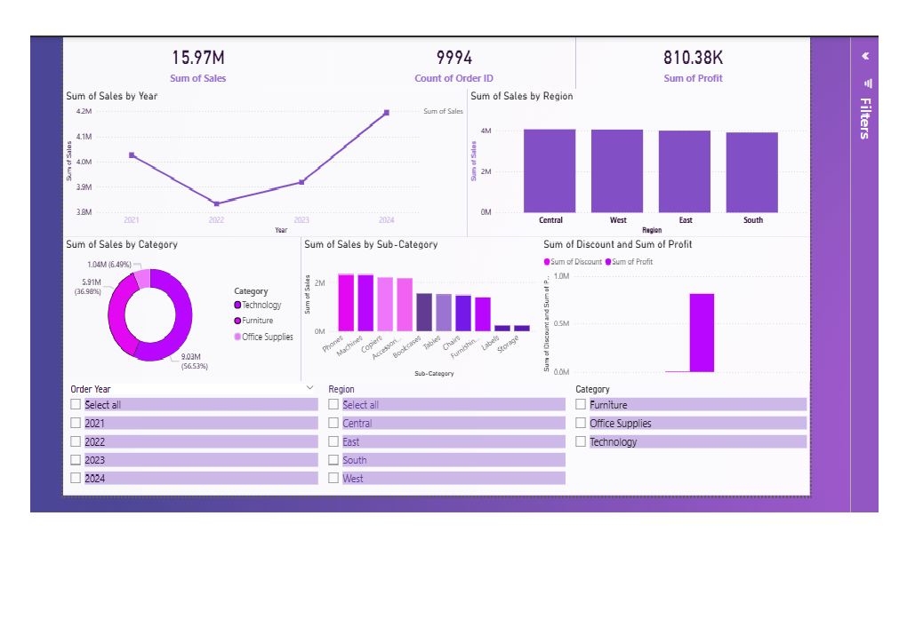

# Sales Trend Visualization Dashboard

> **Project 1 of 4** — Data Analytics Portfolio | Basic Level

A complete end-to-end data analytics project covering data generation, cleaning, analysis, and interactive dashboard visualization using Python and Power BI.

---

## Project Overview

This project analyzes **4 years of retail sales data (2021–2024)** to uncover trends, identify top-performing categories and regions, and visualize business performance through an interactive Power BI dashboard.

The dataset is a synthetic Superstore-style dataset with ~10,000 rows, intentionally designed with real-world messiness (missing values, duplicates, inconsistent formatting) to practice data cleaning skills.

---

## Key Business Insights

1. **Sales grew 7% in 2024** after a dip in 2022 — the business recovered and is trending upward
2. **Technology is the revenue engine** — contributing over 56% of total sales, led by Phones, Machines, and Copiers
3. **Central region leads** in both total sales and profit margin across all 4 years
4. **May and August are peak sales months** — useful for inventory planning and staffing decisions
5. **Binders have the thinnest profit margin** among top sub-categories — a candidate for a pricing review
6. **High discounts (30%+) significantly reduce profit margins** — discounting strategy needs review

---

## Project Structure

```
sales-trend-dashboard/
├── data/
│   ├── sales_data_raw.csv          # Original messy dataset (10,034 rows)
│   ├── sales_data_cleaned.csv      # Cleaned and enriched dataset (9,994 rows)
│   ├── summary_yearly.csv          # Yearly sales and profit aggregation
│   ├── summary_monthly.csv         # Monthly trend data
│   ├── summary_category.csv        # Sales breakdown by category
│   ├── summary_region.csv          # Regional performance summary
│   └── summary_discount.csv        # Discount impact analysis
├── script/
│   ├── generate_data.py            # Synthetic dataset generation script
│   ├── clean_data.py               # Data cleaning and enrichment script
│   └── analyze_data.py             # Exploratory data analysis script
├── sales_dashboard.pbix            # Power BI dashboard file
├── dashboard_screenshot.png        # Dashboard preview image
└── README.md
```

---

## Tools & Technologies

| Tool | Purpose |
|------|---------|
| Python 3 | Data generation, cleaning, analysis |
| pandas | Data manipulation and aggregation |
| numpy | Numerical operations |
| Power BI Desktop | Interactive dashboard visualization |
| GitHub | Version control and portfolio hosting |

---

## Project Workflow

```
Raw Data → Data Cleaning → Exploratory Analysis → Dashboard → Insights
```

### Step 1: Data Generation
Generated a realistic 10,034-row Superstore-style dataset with intentional messiness:
- 150 missing Sales values
- 80 missing Region values
- 35 duplicate rows
- Inconsistent text casing (e.g. "EAST" vs "East")

### Step 2: Data Cleaning (`clean_data.py`)
- Fixed inconsistent text casing using `.str.title()`
- Removed 40 duplicate rows
- Filled missing Region values using State → Region mapping
- Imputed missing Sales values using category median
- Converted date columns to proper datetime format
- Added 6 derived columns: Order Year, Order Month, Year-Month, Shipping Days, Profit Margin %

**Before cleaning:** 10,034 rows | 80 null Regions | 152 null Sales | 35 duplicates

**After cleaning:** 9,994 rows | 0 nulls | 0 duplicates

### Step 3: Analysis (`analyze_data.py`)
Computed 8 key analysis areas:
- Overall KPIs (Total Sales, Profit, Orders, Margin)
- Yearly and monthly sales trends
- Seasonal patterns by calendar month
- Category and sub-category breakdowns
- Regional performance comparison
- Discount impact on profit margin
- Customer segment analysis

### Step 4: Dashboard (Power BI)
Built an interactive dashboard with:
- 3 KPI cards (Total Sales, Total Orders, Total Profit)
- Monthly sales trend line chart
- Sales by region bar chart
- Sales by category donut chart
- Top sub-categories bar chart
- Discount impact column chart
- 3 interactive slicers (Year, Region, Category)

---

## Dashboard Preview



---

## Key Metrics

| Metric | Value |
|--------|-------|
| Total Sales | $15.97M |
| Total Profit | $810.38K |
| Total Orders | 9,994 |
| Overall Profit Margin | 5.07% |
| Top Category | Technology (56.53%) |
| Top Region | Central |
| Peak Sales Month | May & August |
| Date Range | Jan 2021 – Dec 2024 |

---

## How to Run

### Python Scripts
```bash
# Install dependencies
pip install pandas numpy

# Generate raw dataset
python script/generate_data.py

# Clean the data
python script/clean_data.py

# Run analysis
python script/analyze_data.py
```

### Power BI Dashboard
1. Download and install [Power BI Desktop](https://powerbi.microsoft.com/desktop/) (free)
2. Open `sales_dashboard.pbix`
3. Use the slicers to filter by Year, Region, or Category

---

## What I Learned

- How to identify and fix real-world data quality issues (nulls, duplicates, inconsistent formatting)
- How to engineer useful features from raw date columns
- How to aggregate and summarize large datasets using pandas groupby
- How to build interactive dashboards in Power BI with slicers and KPI cards
- How to extract plain-English business insights from data

---

## Portfolio

This is **Project 1 of 4** in my data analytics portfolio:

| # | Project | Level | Status |
|---|---------|-------|--------|
| 1 | Sales Trend Visualization | Basic | ✅ Complete |
| 2 | Customer Churn Prediction | Intermediate | 🔄 Coming Soon |
| 3 | Big Data Insights Dashboard | Advanced | 🔄 Coming Soon |
| 4 | AI-Powered BI Dashboard | Pro | 🔄 Coming Soon |

---

##  Author

**Vaishnavi** — Aspiring Data Analyst

---


